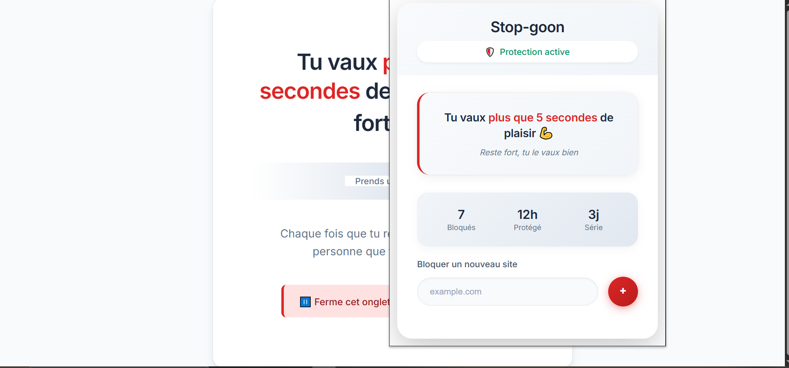

# Stop-Goon — Extension Chrome de blocage de sites pornographiques 🚫

Bloque automatiquement les sites indésirables grâce à une base de données JSON configurable.

## Aperçu 📸

## Description

Stop-Goon est une extension Chrome légère qui bloque automatiquement l’accès à une liste de sites pornographiques référencés dans un fichier JSON. Elle remplace la page bloquée par un message motivant, court et simple, pour aider l’utilisateur à garder le contrôle de ses envies.

---

## Fonctionnalités

- Chargement dynamique et asynchrone de la liste des sites à bloquer (depuis `urls.json`).
- Utilisation de l’API Chrome `tabs` pour récupérer l’URL active de l’onglet en cours.
- Blocage automatique sans intervention manuelle (pas besoin de cliquer sur un bouton).
- Remplacement complet du contenu de la page bloquée par un message encourageant personnalisé.
- Message court et impactant pour motiver l’utilisateur.
- Sauvegarde et gestion des données via `chrome.storage`.
- Possibilité pour l’utilisateur de télécharger manuellement la liste JSON.
- Icônes PNG aux formats requis par le Chrome Web Store (16x16, 48x48, 128x128).
- Code propre, commenté et structuré.

---

## Installation

1. Clonez ce dépôt.
2. Ouvrez Chrome et allez dans `chrome://extensions/`.
3. Activez le **Mode développeur**.
4. Cliquez sur **Charger l’extension non empaquetée**.
5. Sélectionnez le dossier du projet.

---

## Utilisation

- L’extension vérifie automatiquement l’URL active à chaque changement d’onglet ou chargement de page.
- Si le site correspond à un domaine bloqué dans la liste JSON, la page est vidée et remplacée par un message motivant.
- L’utilisateur peut modifier la liste des sites bloqués en éditant le fichier `urls.json`.

---

## Structure du projet

